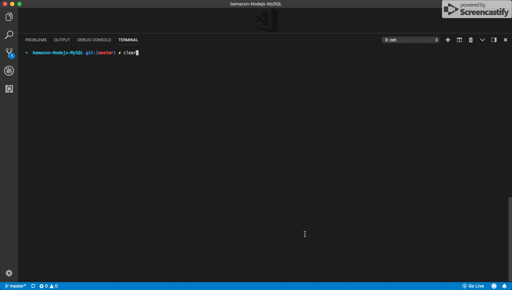
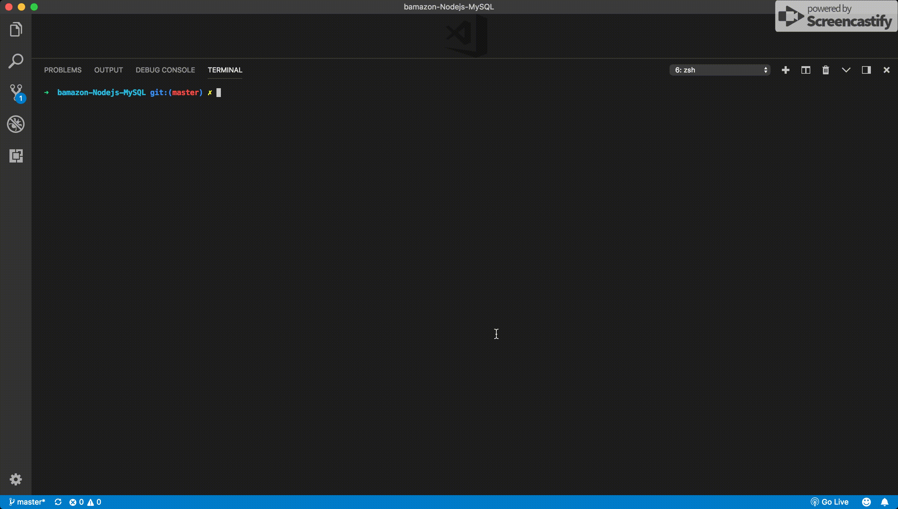
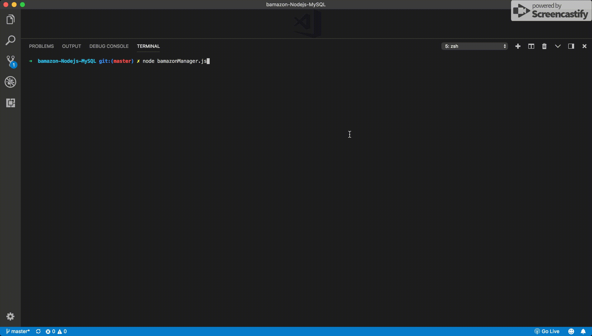

# Bamazon-Nodejs-MySQL

An Amazon-like storefront app implemented `Node.js` and  `MySQL` to take in orders from customers and deplete stock from the store's inventory. 

---
## Technologies used
* `Node.js`
* `MySQL`
* `Inquirer` npm
* `RegEx`

---
## How this App Works

### Customer View

* Running `bamazonCustomer.js` will first display all of the items available for sale. Include the ids, names, and prices of products for sale. Customers will only see the products that the store has in stock.
* Then, the app will prompt users with two messages:
    * The first should ask them the ID of the product they would like to buy.
    * The second message should ask how many units of the product they would like to buy.
* When customer wants to buy an item, the app will check if the store has enough of the product to meet the customer's request.
    * If the store does have enough of the product, the app will fulfill the customer's order.
        * This means updating the SQL database to reflect the remaining quantity.
        * Once the update goes through, show the customer the total cost of their purchase.
        
    * If there isn't enough of the product left in stock, the database doesn't fulfill the order, and the app tells the user. 
    
### Manager View

* Running `bamazonManager.js` will first list a set of menu options:
    * View Products for Sale
    * View Low Inventory
    * Add to Inventory
    * Add New Product
    * Quit Bamazon Manager
    
    
* If a manager selects `View Products for Sale`, the app will list every available item: the item IDs, names, prices, and quantities.
* If a manager selects `Quit Bamazon Manager`, it will exit this node application.

    
* If a manager selects `View Low Inventory`, then it will list all items with an inventory count lower than fifty.
* If a manager selects `Add to Inventory`, the app will display a prompt that will let the manager "add more" of any item currently in the store.

    
* If a manager selects `Add New Product`, it will allow the manager to add a completely new product to the store.

---
## Author

[Keen Wilson](https://keenwilson.com "Keen Wilson's Portfolio")
